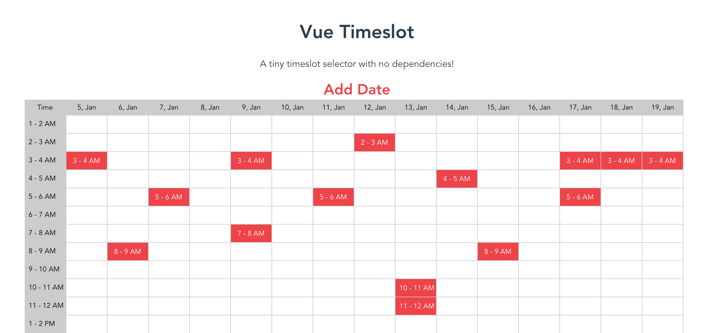

# Vue Time Slot

A tiny Vue time slot selector component with no dependencies for your app!

## Installation

`npm install vue-time-slot --save`

### Usage

```javascript
import VueTimeSlot from "vue-time-slot";

new Vue({
  el: "#app",

  components: {
    VueTimeSlot
  }
});
```

```html
<vue-time-slot :min="5" ></vue-loop>
```

## Optional Props

| Prop |  Type  | Default |
| ---- | :----: | :-----: |
| Min  | Number |    5    |

## Features

* Lightweight
* No dependencies
* Time and Date format

## TODO

* DEMO
* Time format: 12 / 24
* Date format: ( moment type: l, L, LL, ll )

## License

Licensed under the MIT License and maintained by [Nobal](http://nobal.in/)
